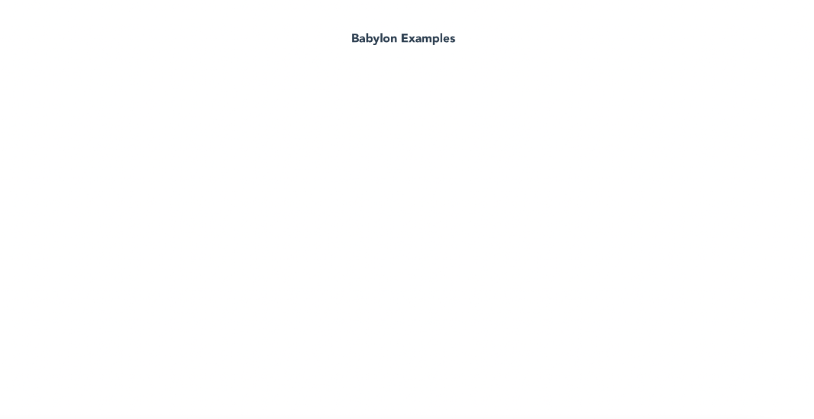
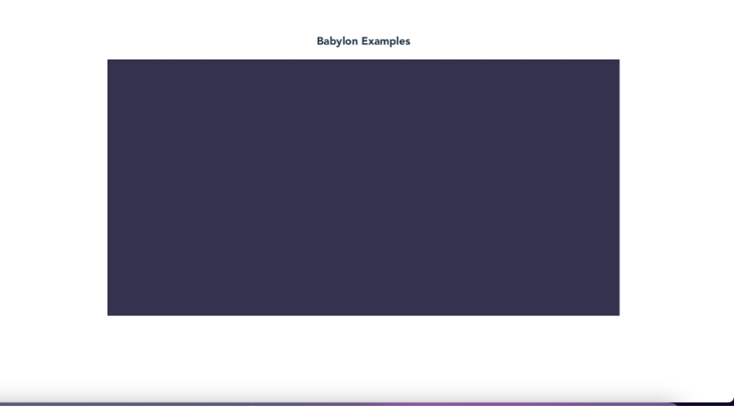
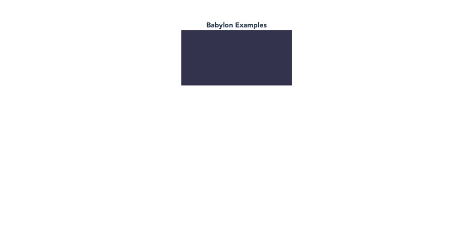
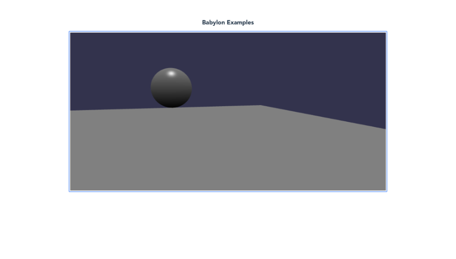

## March, 31:

Today I learned creating a Basic Scene in BabylonJs.
*Babylon.js is a real time 3D engine using a JavaScript library for displaying 3D graphics in a web browser via HTML5. The source code is available on GitHub and distributed under the Apache License 2.0.* 

The most important thing: Change Scene.ts and check in the local host if you have the right positions, such as the right position for the camera, which is our eyes, so you can see our 3D meshes!

*In the 3D virtual world shapes are built from meshes, lots of triangular facets joined together, each facet made from three vertices. Babylon. js provides for the creation of predefined meshes, of your own custom meshes and for importing meshes created by 3D design software.*
Also, I used an HTML extension, very useful, so I didn’t have to import modules manually :)

Resources:
https://www.babylonjs.com 
https://doc.babylonjs.com/divingDeeper/mesh/creation/set/sphere 
https://doc.babylonjs.com/divingDeeper/mesh/creation/set/ground 
https://www.youtube.com/watch?v=NLZuUtiL50A 
https://vuejs.org/

### 🔸 Project Setup
```
npm install
```

1. Installing Vue 3, Typescript and BabylonJS
Install Vue
*Vue is a modern front-end framework similar to React and Angular but beginner-friendly and easy to use.* 
```
sudo npm i -g @vue/cli
```
2. Check Vue version
```
vue –version 
```
3. Create vue project: 
```
vue create *name*
```
4. Answer questions:
• Manually select features, return. Select TypeScript by going down, hit enter.

• Choose verion of vue.js -> 3.x

• Use class-style component syntax? N

• Use Babel alongside TypeScript -> N

• ESLint with error prevention only 

• Lint on save

• In dedicated config files 

• Save this as a preset for future projects? N

• Will see:

Installing CLI plugins. This might take a while…
👉  Get started with the following commands:

 $ cd b101
 $ npm run serve

5. CMD+K -> to clear terminal

### 🔸 Creating the BabylonExamples Vue component

1. Enter b101 directory
```
cd b101
```
2. Compile and hot-reload for development
```
npm run serve
```
> b101@0.1.0 serve
> vue-cli-service serve

 INFO  Starting development server...
 DONE  Compiled successfully in 1919ms                                                        10:06:58

 App running at:
  - Local:   http://localhost:8081/ 
  - Network: unavailable

3. CMD click on - Local:   http://localhost:8081/  
Tab opened! -> Welcome to Your Vue.js + TypeScript App
 Stop Terminal: CTR+C

4. Install Other packages needed: core babylon package -> Typescript version of babylonjs, which we will be using
```
sudo npm i @babylonjs/core
```

5. CMD+K

### 🔸 Creating a Babylon Typescript Class
1. Go to b101 -> src -> components
2. HelloWorld.vue -> BabylonExamples.vue
3. VUE component: 1)HTML written in js 2) script 3 )styles (CSS) - scope to one component:
4. Install HTML Snippetsv0.2.1 extension to make HTML writing easier
5. Create div, Create h3
6. Create canvas -> will be empty, but will work on it in script’s section
7. Modify script :
• Change name 
name: 'BabylonExamples'

• Remove props

• Add  mounted() {
const canvas = document.querySelector("canvas");
}
8. Go to app.vue -> Modify it
<BabylonExamples msg="Welcome to Your Vue.js + TypeScript App"/>
 -> Delete
• Change all HelloWorld to BabylonExamples

9. Enter b101 -> npm run serve -> check host -> See changes!



### 🔸 Rendering Babylon Scene in Vue

1. Create a new class: src -> New Folder -> “BabylonExamples’ (here we are going to keep all TypeScript files, keep organized & abstract! -> New File -> “BasicScene.ts”

2. In basic Scene:

• Create class BasicScene

• constructor (built-in method)
• constructor(canvas:HTMLCanvasElement) {
• Test it in Babylon Examples to see how our scene works
• Import Basic Scene to BasicExamples
3. Change mounted -> add BasicScene
• Check -> purple box too small, nut we have CANVAS



4. Modifying CSS for the Canvas
5. Want box to be 70% of tha scene
6. Go to BabylonExamples.ts
• Remove style things
• We want to modify canvas, so use basic CSS :)

• Width: 70%,
• height:70%
Save and see this :



### 🔸 Adding Camera and Hemisphere
### 🔸 Adding 3d Meshes 
### 🔸 Modify Mesh Positions

*See comments in BasicScene.ts*

### 🔸 Moving Camera Position
1. Go the BasicScene and change CreateScene() Method
2. Test
3. Camera starts in the center (0, 1, 0), so we need to move it bacl to see the sphere
If camera is in the ball, we won’t see it, bc inner portion of mesh is not rendered, unless we specify we want it rendered
4. Change value of z axis to -5 for camera

Final product:



**It moves! done!**
