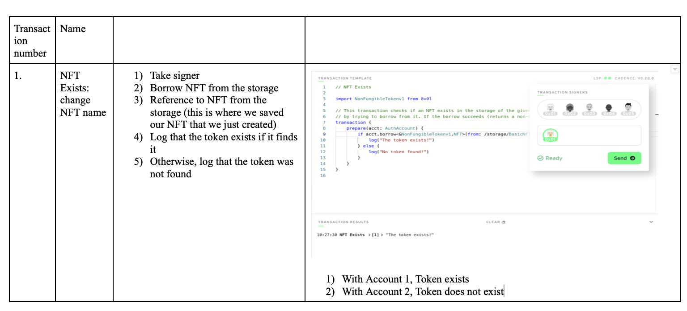
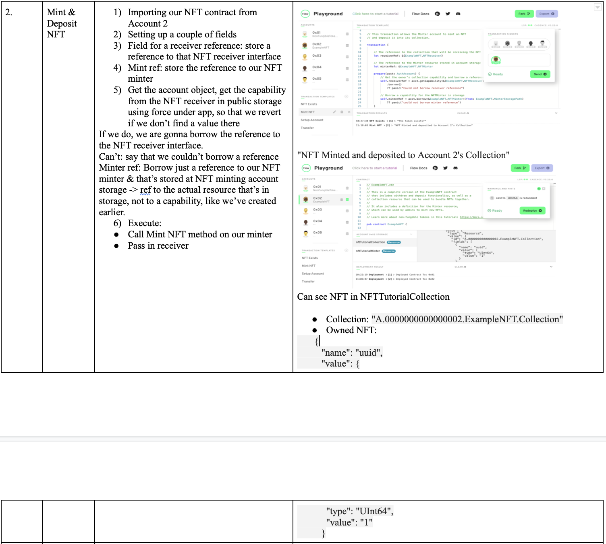
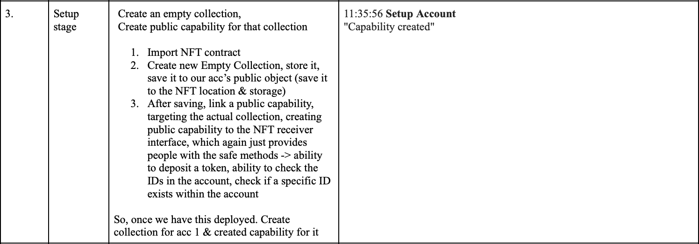
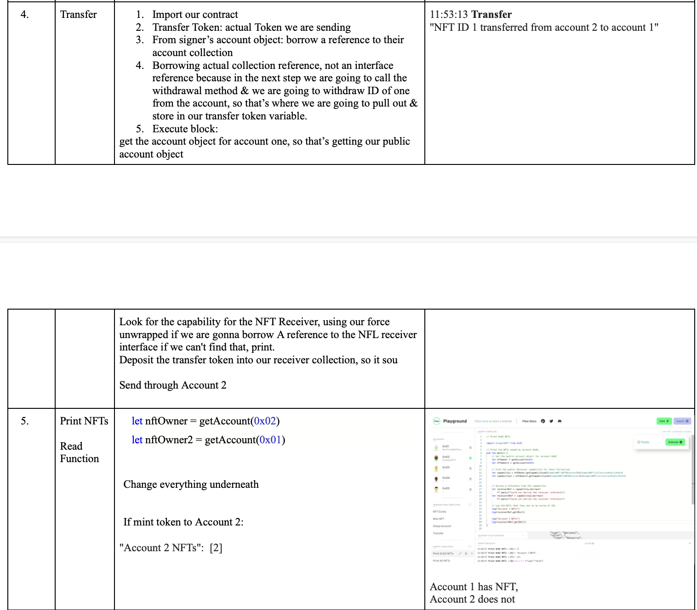

# May, 12: Cadence Non-Fungible Token 

### 🔸 Reflection

Creating NFT on Polygon, Ethereum Mainnet, and now Flow Blockchain (native currency: FLOW) to get the best user experience (it needs to be easier to add NFT to Wallet). 

With Ethereum & Polygon, to add NFT to the Meta Mask Wallet, you need to input the NFT address & Token ID manually. Like this: https://allthings.how/how-to-add-nft-to-metamask/ 

Extra steps make it harder to sell NFT.

I just found two vids on how to create NFT Collection with it: https://www.youtube.com/watch?v=eqYKEKPQbWI . However, the video just shows how to build a simple NFT contract on the Flow Blockchain, Write Functions (Mint NFT, Setup Account, Transfer), and Read Functions/script (print Account NFTs).

Templates: https://docs.onflow.org/cadence/tutorial/04-non-fungible-tokens/ .

Flow’s programming language - Cadence, Wallet - Blocto 

What makes Flow unique: Validation process: Flow splits validation tasks into four different types of nodes: consensus, verification, execution, and collection. All four node types participate in the validation of each transaction. 

About Flow: https://decrypt.co/resources/what-is-flow-dapper-labs

## 🔸 Description
Creating a basic NFT contract in Cadence

## 🔸 Full

See the full tutorial here: https://docs.onflow.org/cadence/tutorial/04-non-fungible-tokens/

## 🔸 About Playground Export
This project was generated from Playground living here:
[https://play.onflow.org/be308e35-6fed-42af-ab32-7343d7e44c62](https://play.onflow.org/be308e35-6fed-42af-ab32-7343d7e44c62)

Basics tests, which you can run using Node, Flow Emulator and Flow JS Testing Framework.

## 🔸Installation
### Node 

https://nodejs.org/en/download/

### Flow Emulator
Flow Emulator is bundled with Flow CLI. You can find instructions on how to install it on Flow Docs site:
https://docs.onflow.org/flow-cli/

### Flow JS Testing Framework
All the necessary files will be installed if you run `npm install` inside `test` folder. For documentations on how to use
the framework you can consult package repository [https://github.com/onflow/flow-js-testing](https://github.com/onflow/flow-js-testing)

### 🔸 Next Step
When all the above tools would be installed you will need to init Flow Emulator with `flow init` command from within
`test` folder. This will create `flow.json` file in the folder, which is necessary for emulator to operate properly.

Proceed running the tests. Run "Create Accounts", then "Deployment" and then transactions and scripts.

### 🔸 Steps 

1. Create Example NFT Flow NFT Collection, we can mint, deposit (not customized, but we can differentiate it through ids)

2. *other functions*

3. Mint NFT: Create NFT, Create our resource, using ID Count to set the ID, increment ID Count after done, depositing that to our recipients NFT receiver

4. Initializing contract: 

store an empty NFT Collection in account storage

publish a reference to the Collection in storage

store a minter resource in account storage

ADMIN ACCOUNT - give ability to mint NFTs, pop that to a different location in storage bc it's a diff resource

5. Deploy


## 🔸 Summary:

Minted the NFT, Deposited it into the Account 2, created a collection and a public capability for Account 1 -> allowed us to…, Transfer the token that was in account 2 to Account 1

So, if account 1 never set up their collection, Transfer would fail -> Account 2 would still have owned that Token because there would be no reference of where to send it.


### 🔸 Additional:

1. Transfer Token 3 to Account 3 Collection 
2. For that, Deploy Account 3 & Setup Account
3. Transfer:

change:
```
self.transferToken <- collectionRef.withdraw(withdrawID: 3)
let recipient = getAccount(0x03)
```

4. Result: "NFT ID 3 transferred from account 2 to account 1"


### ALso, deployed https://github.com/onflow/kitty-items just following steps. 

1. brew install flow-cli

2. git clone https://github.com/onflow/kitty-items.git

3. cd kitty-items

4. npm install

5. if you are on an Apple M1 machine, run the following as well
```
>> cd web/ 
>> npm i @next/swc-darwin-arm64
>> cd ..
```
6. run the project on the Flow testnet

npm run dev:testnet

7. View log output: npx pm2 logs web

### 🔸Function Summaries






**🔸Resources:🔸**

• https://www.youtube.com/watch?v=eqYKEKPQbWI

• https://docs.onflow.org/cadence/tutorial/04-non-fungible-tokens/

• https://docs.onflow.org/flow-cli/install/

• https://github.com/onflow/kitty-items

• https://www.onflow.org/post/nft-marketplace-video-tutorial-flow-blockchain-build-develop-kitty-items

• https://docs.onflow.org/cadence/tutorial/06-marketplace-compose/

•  https://medium.com/blockick/blocto-a-step-by-step-guide-with-screenshots-2-buying-nfts-and-checking-your-crypto-assets-7035cbfec784
