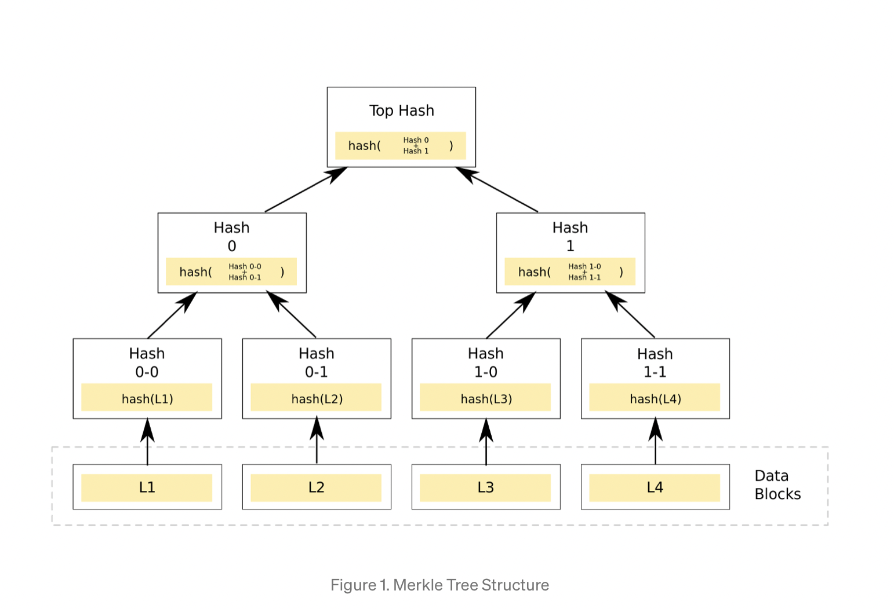
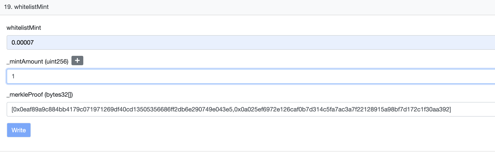

## April, 19


## 🔸 Introduction:

To understand how the code works, I recommend reading this article: https://medium.com/@ItsCuzzo/using-merkle-trees-for-nft-whitelists-523b58ada3f9 . Basically, Merkle Trees is a tree-like structure where every node on the tree is represented by a value that is the result of some cryptographic hash function, and we will use this characteristic as the base of our code. For example, Hash 0 = Hash (0-0, 0-1).



• **Why we need it**:

To know the Merkle proof input for WhitelistMint Function to enable whitelist sale (before that run yarn whitelist-open --network truffle):



## 🔸 Step 1 (Optional - can create manually in VScode)

In Terminal:
1. 
```
>> cd Desktop 
>> mkdir merkle_tree
>> cd merkle_tree
>> clear
>> ls -l 
```
2)
```
>> np init -y
>> ls -l
Total 4
>> npm install keccak256 merkletreejs
To open project in VS code:
>> code . 
```
3) make sure you have node. Use `npm` package manager to install 
```
>> node -v
```

## 🔸 Step 2: The Code

1. Import libraries (merkletreejs, kecacak256). Use `npm` package manager to install

2. From competitions, games, etc., **collect a list of wallet addresses** you want to enable for whitelist sales. Store these list of addresses in some data sheet. Paste an array of whitelist addresses with “...”

3. Create leaf nodes from these whitelist addresses. Use whitelistAddresses.map, take every address and hash it using keccak256

4. Create a Merkle Tree using leaf nodes 

5. Get root hash of the `merkleeTree` in hexadecimal format (0x). Print out the entire Merkle Tree.

## 🔸 Step 3: CLIENT-SIDE

1. Get the address that is claiming it is on the white list using leaf nodes at any index (or any other node, such as `keccak256("0x8a61B674AEFE7e283f3879b4536E6956eE402669")`).

2. Print out the Hex Proof (merkle proof) required to derive the root hash of the Merkle Tree

3. Verify if the address is actually in the Whitelist: `console.log(merkleTree.verify(hexProof, claimingAddress, rootHash))`;

## 🔸 Step 4: Output

From the output, we can see:

• Merkle Root

• Merkle Proof

• Does the claiming address belong in the whitelist?


## 🔸 Resources:

• https://medium.com/@ItsCuzzo/using-merkle-trees-for-nft-whitelists-523b58ada3f9
